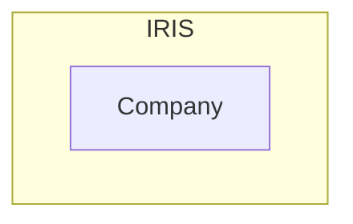

# My-study-about-REST-API-on-IRIS
This is about what happened on my while I was studing the REST API on IRIS - A data platform with flxible interoperability 

### Let's talk about sth not related to coding
You may not know about me... In reality I am not a programmer and I am not good at coding... My interest is simply looking around and trying out some simple stuff (Sorry I cannot handle the complicate stuff) <br>
As I am not a programmer, don't expect me can do some technical writing here. Come on, I know here is not a place for writing novel.....me, however, just simply want to write sth in my way.
- for my future review
- for sbd might have a chance who uderstand what I am talking about
- for sbd might have some inspiration after taking a glance at my simple work
- or for sbd simplly love reading a novel about a poor code writer trying out sth that she don't know

Here thank you for your reading (maybe I am the only one reading this story)


### OK, let's comeback to the topic
Recently, I was studing sth about IRIS and majorly focus on the interoperability. (you may see my pervious work was on pyodbc, and I have as few work on the Python NativeAPI after that, maybe share later) <br>
Why playing on the interoperability? just simply sbd told me that it is easy to use. can connect to many diffierent systems with different protocrol/standard/communcationMethod <b>SIMPLY</b> <br> 
You know when a woman like me heard about <b>many diffierent systems</b> and <b>SIMPLY</b>, my eyes blink!!!<br>
OK, I decided to start with sth common, the REST api

### For my understanding, in the REST world we can be the HOST or client
Just like joining a party, being a guest (client) is always more relax than being a host. <br>
To be a guest, you just simply dress up, prepare some food, or take a brunch of flower and attend the party.<br>
To be a host, hahahha tons of work to do... setup the place, prepare the F&B, deciede the run down, and the most tragic things ------- do the cleaning after party.<br>
<br>
Conceptraly, things should be similar in building a Host or a client.<br>
But for me, a poor program writer, I found that it is more difficult for me to build a REST client on IRIS than building a host <br>
The reason is simply becasuse there are planty of resourse which teach you how to build a host (maybe they think building a host is a more complex concept, and you may need more guidience) <br>
For me, however, for the simple thing, I need gudience also ...... I am not good a coding.. not even the relationship between HTTP and REST ok?<br>
Although I found out an easy way to build a clinet, but it was not easy for me (at least for me) to find that way. <br>
That's why triggered me to write down sth. I am pretty sure that I will forget totally in the future, if I didn't write down any hints for myself.<br>

## In my study, I divided in to 3 sessions
| |Session|Description|
|---|---|---|
|1| Setup a REST API host interface on IRIS| this allow you to access objects/table in IRIS directly |
|2| Connect the REST API interface to IRIS production| this allow you to commumate with the other system connected to IRIS within the production environment|
|3| Setup a REST API client interface on IRIS production| this allow the other systems connected to IRIS within the production environment talk to you|

You can easliy learn **Session 1 and 2** from the online learning service from InterSystems by <br>
Visit the course **Setting Up RESTful Services** https://learning.intersystems.com/course/view.php?id=1298 <br>
And it have quite a lot pages to talk about in on the online document<br>
**REST and JSON**https://docs.intersystems.com/irislatest/csp/docbook/DocBook.UI.Page.cls?KEY=PAGE_rest_json<br>
But I must say sorry to the writter, I can undertand the word, I can understand the sentenses, but I don't know how to make it work!!!<br>
So I went back to the online learning<br>
<br>
But you can only find the information about **Session 3** from the online document<br>
**Creating REST Operations in Productions**https://docs.intersystems.com/irislatest/csp/docbook/DocBook.UI.Page.cls?KEY=EREST_operation <br>
only 1 page .... maybe it is good enough for you... but it is tooo hard for me to understand what is happening....<br>
Anyway, let's go 

## Session 1 - Setup a REST API host interface on IRIS
Before making a REST interface, I created an object class **Company** on my IRIS platfrom.<br>
Initally, I really hope that to have place to store the WebURL if different compnay, just like a phonebook.<br>
And I can search for them in the future, and actually I have made a UI for query, select and update these **Company** objects by Python tkinter and nativeAPI.<br>
But suddently, I sth come up in my mind. Maybe, or might be, or it might likely to be, the data sbd found that the data inside my **Company** objects are very useful for them too!!!!<br>
Ohhhhh it is such a good news! I should let them join my party and help to maintain the data!!<br>
That's the reason I want to setup a REST API for accessing my **Company** objects
```
Class KLlibrary.BObj.Company Extends (%Persistent, %JSON.Adaptor)
{
Property Name As %String [ Required ];
Index NameIndex On Name;
Property WebURL As %String(MAXLEN = 300);
Property Description As %String(MAXLEN = 2000);
Property Remark As %String;
Property EstablishYear As %Integer;
}
```
You can see that my **Company** class extended 2 objects, %Persistent and %JSON.Adaptor
- %Persistent allows us to %New() the company objects and %Save() them in the IRIS database
- %JSON.Adaptor allows us to use the method under the %JSON.Adaptor, normally, it is not a must to include it. <br>In our case, we are going to work on the REST API and it is more easy to package our data into a JSON string and send it out (or take them in). So it's better have this little tools

So now, I have a company class on IRIS

