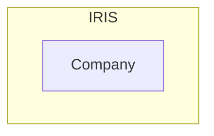

# My-study-about-REST-API-on-IRIS
This is about what happened on my while I was studing the REST API on IRIS - A data platform with flxible interoperability 

### Let's talk about sth not related to coding
You may not know about me... In reality I am not a programmer and I am not good at coding... My interest is simply looking around and trying out some simple stuff (Sorry I cannot handle the complicate stuff) <br>
As I am not a programmer, don't expect me can do some technical writing here. Come on, I know here is not a place for writing novel.....me, however, just simply want to write sth in my way.
- for my future review
- for sbd might have a chance who uderstand what I am talking about
- for sbd might have some inspiration after taking a glance at my simple work
- or for sbd simplly love reading a novel about a poor code writer trying out sth that she don't know

Here thank you for your reading (maybe I am the only one reading this story)


### OK, let's comeback to the topic
Recently, I was studing sth about IRIS and majorly focus on the interoperability. (you may see my pervious work was on pyodbc, and I have as few work on the Python NativeAPI after that, maybe share later) <br>
Why playing on the interoperability? just simply sbd told me that it is easy to use. can connect to many diffierent systems with different protocrol/standard/communcationMethod <b>SIMPLY</b> <br> 
You know when a woman like me heard about <b>many diffierent systems</b> and <b>SIMPLY</b>, my eyes blink!!!<br>
OK, I decided to start with sth common, the REST api

### For my understanding, in the REST world we can be the HOST or client
Just like joining a party, being a guest (client) is always more relax than being a host. <br>
To be a guest, you just simply dress up, prepare some food, or take a brunch of flower and attend the party.<br>
To be a host, hahahha tons of work to do... setup the place, prepare the F&B, deciede the run down, and the most tragic things ------- do the cleaning after party.<br>
<br>
Conceptraly, things should be similar in building a Host or a client.<br>
But for me, a poor program writer, I found that it is more difficult for me to build a REST client on IRIS than building a host <br>
The reason is simply becasuse there are planty of resourse which teach you how to build a host (maybe they think building a host is a more complex concept, and you may need more guidience) <br>
For me, however, for the simple thing, I need gudience also ...... I am not good a coding.. not even the relationship between HTTP and REST ok?<br>
Although I found out an easy way to build a clinet, but it was not easy for me (at least for me) to find that way. <br>
That's why triggered me to write down sth. I am pretty sure that I will forget totally in the future, if I didn't write down any hints for myself.<br>

## In my study, I divided in to 3 sessions
| |Session|Description|
|---|---|---|
|1| Setup a REST API host interface on IRIS| this allow you to access objects/table in IRIS directly |
|2| [Connect the REST API interface to IRIS production](https://github.com/ecelg/My-study-about-REST-API-on-IRIS/blob/main/ReadmeSession2.md)| this allow you to commumate with the other system connected to IRIS within the production environment|
|3| Setup a REST API client interface on IRIS production| this allow the other systems connected to IRIS within the production environment talk to you|

You can easliy learn **Session 1 and 2** from the online learning service from InterSystems by <br>
Visit the course [Setting Up RESTful Services](https://learning.intersystems.com/course/view.php?id=1298) <br>
And it have quite a lot pages to talk about in on the online document<br>
[REST and JSON](https://docs.intersystems.com/irislatest/csp/docbook/DocBook.UI.Page.cls?KEY=PAGE_rest_json)<br>
But I must say sorry to the writter, I can undertand the word, I can understand the sentenses, but I don't know how to make it work!!!<br>
So I went back to the online learning<br>
<br>
But you can only find the information about **Session 3** from the online document<br>
[Creating REST Operations in Productions](https://docs.intersystems.com/irislatest/csp/docbook/DocBook.UI.Page.cls?KEY=EREST_operation)<br>
only 1 page .... maybe it is good enough for you... but it is tooo hard for me to understand what is happening....<br>
Anyway, let's go 

## Session 1 - Setup a REST API host interface on IRIS
Before making a REST interface, I created an object class **Company** on my IRIS platfrom.<br>
Initally, I really hope that to have place to store the WebURL if different compnay, just like a phonebook.<br>
And I can search for them in the future, and actually I have made a UI for query, select and update these **Company** objects by Python tkinter and nativeAPI.<br>
But suddently, I sth come up in my mind. Maybe, or might be, or it might likely to be, the data sbd found that the data inside my **Company** objects are very useful for them too!!!!<br>
Ohhhhh it is such a good news! I should let them join my party and help to maintain the data!!<br>
That's the reason I want to setup a REST API for accessing my **Company** objects
```
Class KLlibrary.BObj.Company Extends (%Persistent, %JSON.Adaptor)
{
Property Name As %String [ Required ];
Index NameIndex On Name;
Property WebURL As %String(MAXLEN = 300);
Property Description As %String(MAXLEN = 2000);
Property Remark As %String;
Property EstablishYear As %Integer;
}

```
You can see that my **Company** class extended 2 objects, %Persistent and %JSON.Adaptor
- %Persistent allows us to %New() the company objects and %Save() them in the IRIS database
- %JSON.Adaptor allows us to use the method under the %JSON.Adaptor, normally, it is not a must to include it. <br>In our case, we are going to work on the REST API and it is more easy to package our data into a JSON string and send it out (or take them in). So it's better have this little tools

So now, I have a company class on IRIS


To make the REST interface for accessing my **company** objects, we will go through the following steps
- Step1 : make a API specification
- Step2 : upload the API specification to IRIS
- Step3 : create a web application on IRIS
- Step4 : implement the API operation method
- Step5 : .... seems no more, maybe play around and enjoy...

Seems very simple, right, maybe... yes.. if you know the trick.<br>

### Step1 : make a API specification
--------------------
The very begining step, we should prepare a API spec file to describe what is you REST api looks like<br>
What I heard is that there is a standard [Swagger Standard](https://swagger.io/specification) for writing a spec file.<br>
If you are using this standard to make a spec file, it is more likely that your spec can be read easily by most of the API management software in the market (I guess, otherwise, why do we need a standard??).<br>
I have prepared mine here [klAPI.spec.json](https://github.com/ecelg/My-study-about-REST-API-on-IRIS/blob/main/klAPI.spec.json)<br>
<br>
I am sorry to let you know that this is my 1st time to write a API spec (yes API spec, not specific to REST). I was so excited and just want to take some of the code to here and explain what I am doing.<br>
<br>
Let's talk about sth inside the path defination<br>
I think that you might know that there are a few basic elements in the REST api for helping you to describe what kind of actions you want to do
|element|In my point of view|
|---|---|
|path| it looks like to tell the host what is the target of this action|
|method| e.g. "get", "post", "put", "delete", tell the host what kind of operation you are going to do with this target|
|parameters| tell the host more specific stuff about this target. just take <br> an example, if you tell your dating agent that I want to ***get*** **(method)** ***boys*** **(path)**. You agent might introduce all the boys on the list to you. Do you think you have time to date them all? So now, you need to say ***long hair*** **(parameter)** plx. Then the result will be much more specific.|
|body| this one will be useful if you want to update some data about your target.<br> an example, your agent introduced a ***long hair*** boy and you found that he cut his hair recently. You may call your agent and update ***the status of the boy***  in the ***conversation*** **(body)** |

<br>
So now lets move on to my work. In my API spec [klAPI.spec.json](https://github.com/ecelg/My-study-about-REST-API-on-IRIS/blob/main/klAPI.spec.json).<br> I defined the following operations <br>
<br>

|path|method|parameter|body| |
|---|---|---|---|---|
|/allcompanies|get| | | by using this operation a list of all companies data will be return in JSON format|
|/newcompany|post||a schema definitions of **Company**| Add a new compnay object. puting a String in JSON format to describe the company that you are going to add. and post it to the host|
|/company|get|id||get the data of a specify company by its id, the data of the target company will be return in JSON format|
|/company|post|id|a schema definitions of **Company**|the data of a specify company with the specifi id will be update according tho the JSON string you upload|
|/company|delete|id||delete the compnay object by its id, i don't like it|

so what is a schema definitions of **Company**, it looks like the following<br>
it descibe the what is my company object looks like

```
"definitions":{
    "Company":{
      "type":"object",
      "properties":{
        "Name":{
          "type":"string"
        },
        "WebURL":{
          "type":"string"
        },
        "Description":{
          "type":"string"
        },
        "Remark":{
          "type":"string"
        },
        "EstablishYear":{
          "type":"integer"
        }
      }
    }
```

So when we want to talk about it in JSON fromat, we can follow the above standard and to make sth in the body<br>
For example

```
{
    "Name": "InterSystems",
    "WebURL": "https://www.intersystems.com/",
    "Description": "",
    "Remark": "",
    "EstablishYear": 1978
}
```

Ok the spec is ready! Let's move on to the next step<br>
<br>
### Step2 : upload the API specification to IRIS
--------------------

This part is pretty easy, but we need a little tools to help us. You might have your favour tool... but for me... I only know one man, who is ***Postman***.<br>
In here I won't explain much about this man, as I am not very familiar with him... <br>
For me, he is doing a great job especially when I testing my API (I can **get** sth from browser, but i don't know how to **post** sth by browser. He helps.)<br>
<br>
Anyway, come back to the topic. I was told that <br>
> you can query the API Management service in your instance of InterSystems IRIS. Send the following HTTP GET request, replacing [YourServer] with the address of your server (and maybe port also) <br><br>
> **GET** http://[YourServer]/api/mgmnt/ <br>
> basic Authentiction is required <br>

In order to test if my API Management service is working. Let's check it out by my ***Postman*** (if the  API Management service is not working, we cannot upload our API spec) <br>
1st, I setup a basic authorization with my IRIS login and password<br>


As my postman is living in the same host of IRIS with port 52773 <br>
So I **Get** the path http://localhost:52773/api/mgmnt/


We can see some information of the interfaces return.. so I assume it should be working.<br>
<br>
Now, we can upload our spec!!<br>
**POST** the path to http://localhost:52773/api/mgmnt/v2/KATEDB/klAPI<br>
  KATEDB <-- Namespace <br>
  klAPI <-- the folder which host the spec, I will show you in a moment<br>
and put my spec (prepared in Step1) into the body, remember to set the fromat to JSON<br>

<br>
Three files are generated a after posting the spec<br>
<br>
<br>
|File|Use for|
|--|--|
|klAPI.spec.cls| the API spec that we upload<br> you can update this file to modifiy the feature of the API|
|klAPI.disp.cls| auto generate class file based on the spec<br> it will re-gen after you recomplile the spec class<br> it helps you the call the correct functio in the XXX.impl.cls class file base on the **Method** and **Path**<br> this file seems not for editing|
|klAPI.impl.cls|auto generate class file based on the spec<br> **Important!!**  it will re-gen after you recomplile the spec class (some of you argeument setting will missing after regen)<br> You should edit this class file to implement the function that you would like to achieve|

<br>

Let's go back to the klAPI.impl.cls file in Step4<br>

### Step3 : create a web application on IRIS
---------
This part is quite stright forward <br>
Open the management portal <br>
**System Administration > Security > Applications > Web Applications**<br>

 <br>
**Create New Web Appliction** <br>

<br>
<br>
Input the **Name** (***Important!*** this will become part of your api URL)<br>
Choose the **Namespace**<br>
Check **Enable Application**<br>
Check **REST** <br>
Input the **Dispatch Class** classname of the .disp.cls (in my example "klAPI.disp")<br>
Check the **Allow Authentcation Method**<br>
Click **Save**<br>

<br>


<br>
Yeah!!! This part is finished!

### Step4 : implement the API operation method
--------
In this part, you may need a little bit knowledge of the object script or you can do it in Embedded Python (I am sorry I am still laerning about embedded python, but I am sure I will share what I learnt soon)<br>
I have uploaded my [klAPI.impl.cls](https://github.com/ecelg/My-study-about-REST-API-on-IRIS/blob/main/klAPI.impl.cls) for you reference. <br>
You may have a better way to write the function, but I want to take part of my code for discussion here<br>
<br>
At the beginning of the code, we have extended 2 classes<br>
- %REST.Impl (generated by default)
- Ens.Rule.FunctionSet (not necessary in this session, added by me in order for leting the business rule can use the function of this class. I will explain in session 2 )

```
Class klAPI.impl Extends (%REST.Impl, Ens.Rule.FunctionSet) [ ProcedureBlock ]
```

I won't go through the function one by one, so I pick the function **EditCompanyById** as an examply to explain how its work<br>

|Arguments| |
|--|--|
|id| id of the company (no default value)|
|body| input data of the compnay in JSON format from the body of the REST message (no default value)|
|prod| for switching the operation to the IRIS Interoperability Production, not using in this session.<br> I set the default value to "". **Important!!** But the defalut value gone after I update the spec. Make sure to write back the default value after you update the spec.|

<br>
In the following code, you can see that id the prod is not 1 (prod =1 will pass to the Session2 part to handel), I open a **Company** object by the id, and that I import the data from the body by using the function **%JSONImport**. and then save the object. The data of the object is then updated.<br>
Very easy right?<br> 
**Important** my **Company** object class should extends the **%JSON.Adaptor**, in order to use the very convinenec**%JSONImport** function.<br>
<br>

```
/// Update existing company given ID and data. Returns updated company<br/>
/// The method arguments hold values for:<br/>
///     id, CompanyId<br/>
///     body, Company Info<br/>
///     prod<br/>
ClassMethod EditCompanyById(id As %Integer, body As %Stream.Object, prod As %Boolean = "") As %DynamicObject
{
    //(Place business logic here)
    //Do ..%SetStatusCode(<HTTP_status_code>)
    //Do ..%SetHeader(<name>,<value>)
    //Quit (Place response here) ; response may be a string, stream or dynamic object
    if prod'=1
    {
	    try
	    {
		    //check if the ID exisit
		    if '##class(KLlibrary.BObj.Company).%ExistsId(id)
		    {
			    do ..%SetStatusCode("400")
	    		return {"ErrorMessage": "No company with this ID"}
		    }
		    
		    //open the company object with the given ID
		    set company=##class(KLlibrary.BObj.Company).%OpenId(id)
		    //fill new Compnay with data from message body
		    do company.%JSONImport(body)
		    do company.%Save()
		    //fill export the compnay data to JSON format
		    do company.%JSONExportToString(.companyOut)
		    return companyOut
	    }
	    catch(ex)
	    {
		    do ..%SetStatusCode("500")
	    	return {"ErrorMessage": "Server Error"}
	    }
    }
    if prod=1
    {
	    //complete the request through the business process
	    try
	    {
		    return ..CallInterface("/company","POST",id,body)
	    }
	    catch(ex)
	    {
		    do ..%SetStatusCode("500")
			return {"ErrorMessage": "Failed business process call"}
	    }
    }
}

```


After we implemented all of the function in the klAPI.impl.cls, we can test it out by postman
list the following example<br>
<br>
<br>


It's working!<br>

### This is the end of session 1.
<br>

[Link to session 2](https://github.com/ecelg/My-study-about-REST-API-on-IRIS/blob/main/ReadmeSession2.md) <br>
